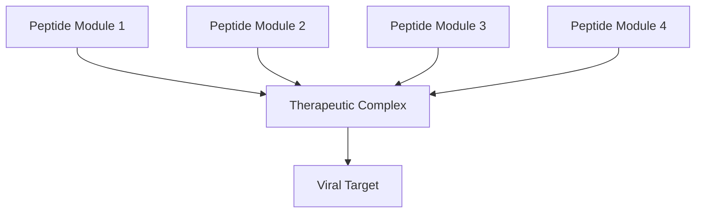

# Recursive Peptide Network (RPN) Framework

## **Introduction**

The **Recursive Peptide Network (RPN) Framework** is a modular and adaptive mechanism designed to complement and enhance the therapeutic potential of the PSREQ Pathway. This framework leverages recursive peptide interactions to address the evolving challenges posed by viral pathogens. By integrating dynamic, modular, and adaptive features, the RPN Framework establishes a foundation for robust and future-proof antiviral interventions.

The RPN Framework introduces recursive interactions, modular adaptability, and stability enhancements, making it an indispensable addition to the PSREQ Pathway.

---

## **Core Principles of the RPN Framework**

### 1. **Recursive Interactions**
The cornerstone of the RPN Framework lies in its ability to facilitate peptide-to-peptide interactions. These interactions enable the formation of stable complexes that amplify the collective efficacy of the therapeutic peptides.

- **Key Mechanisms:**
  - Recursive peptide binding increases the durability of therapeutic complexes in vivo.
  - Enhances the structural and functional stability of PSREQ peptides under varying physiological conditions.
  - Promotes cooperative activity, ensuring synchronized targeting of viral mechanisms.

---

### 2. **Modular Design**
The RPN Framework employs a modular design, allowing for customizable and interchangeable peptide components. Each peptide module is engineered to target specific viral processes or proteins, enabling a multitargeted approach.

- **Advantages of Modularity:**
  - **Adaptability**: Modules can be customized to target evolving viral strains or specific variants.
  - **Scalability**: Enables expansion to other pathogens or conditions beyond the initial HSV or HIV focus.
  - **Precision Targeting**: Multiple modules allow the targeting of glycoproteins, replication enzymes, and structural proteins simultaneously.

---

### 3. **Dynamic Adaptability**
The RPN Framework dynamically adjusts to accommodate mutations or variations in viral targets. This adaptability ensures the framework remains effective against rapidly evolving pathogens.

- **Key Features:**
  - Recursive peptide interactions can adjust their binding mechanisms to respond to mutations in viral proteins.
  - Modular updates to the peptide network can be seamlessly integrated to address new therapeutic challenges.
  - Strengthens the PSREQ Pathway’s resilience to resistance development in viral populations.

---

## **Integration with the PSREQ Pathway**

The RPN Framework amplifies the core capabilities of the PSREQ Pathway by adding a recursive and adaptive layer. Below are the key contributions:

### **1. Enhanced Targeting**
The modular peptides within the RPN Framework are designed to precisely target multiple viral components, including:
- **Glycoproteins** such as gD and gB in HSV.
- Viral DNA polymerase critical for replication.
- Tegument proteins responsible for latency and reactivation.

### **2. Increased Stability**
Recursive interactions among the peptide modules improve the stability of therapeutic complexes. These stabilized interactions:
- Ensure higher systemic bioavailability.
- Protect therapeutic efficacy under adverse conditions such as enzymatic degradation or oxidative stress.

### **3. Multistage Disruption**
By using multiple peptide modules, the RPN Framework can disrupt several stages of the viral lifecycle simultaneously:
- **Entry Inhibition**: Blocking viral attachment to host cells.
- **Replication Suppression**: Halting viral genome replication.
- **Latency Targeting**: Destabilizing epigenetic changes that maintain latency.

---

## **Applications**

### **1. HSV and HIV**
The RPN Framework demonstrates its adaptability through specific applications in HSV and HIV therapeutics:
- In **HSV**, recursive peptides enhance targeting of conserved glycoproteins and replication enzymes while addressing latent reservoirs.
- In **HIV**, modular peptides can be adapted to inhibit viral integrase and reverse transcriptase, critical enzymes in the HIV lifecycle.

### **2. Oncology**
Recursive peptides can be engineered to bind overexpressed tumor antigens, creating opportunities for targeted cancer therapies.

### **3. Autoimmune Disorders**
Modules can be adapted as decoys to intercept autoimmune responses, reducing inflammation and tissue damage.

### **4. Regenerative Medicine**
Recursive peptide interactions can facilitate tissue regeneration by enhancing extracellular matrix stability and promoting cellular repair mechanisms.

---

## **Proposed Workflow**

1. **Design and Synthesis**:
   - Develop peptide modules targeting key viral or cellular components.
   - Engineer peptide sequences for compatibility with recursive interactions.

2. **Validation**:
   - Test the stability and binding efficacy of recursive complexes in vitro and in vivo.
   - Evaluate modular adaptability to address diverse viral mutations.

3. **Deployment**:
   - Integrate RPN modules with existing PSREQ components.
   - Expand applications to other therapeutic domains, such as oncology or regenerative medicine.

---

## **Visual Representation**

### **Recursive Interactions and Modularity**

