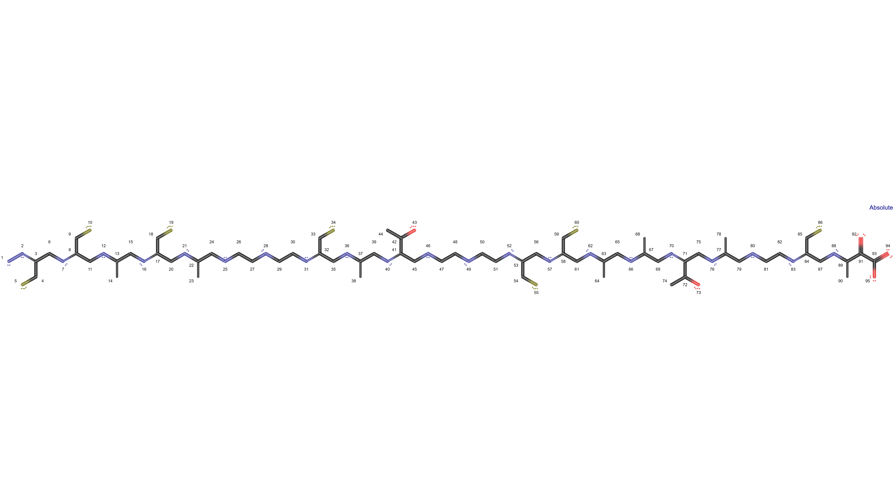
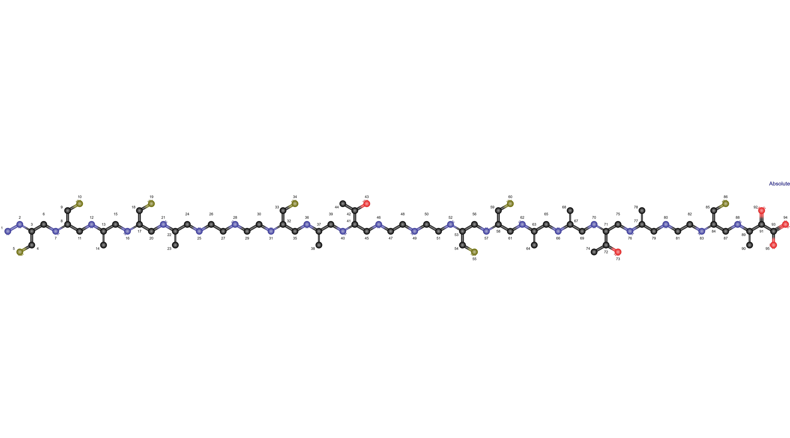
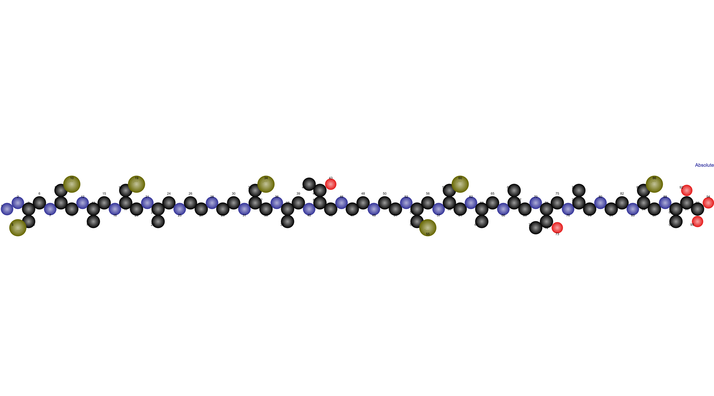

### **Molecule 2: The Stabilizer**

---

#### **Introduction**
Molecule 2, **PSREQ Stabilizer**, serves as the second component of the PSREQ Pathway, designed to anchor therapeutic interactions and enhance molecular resilience during antiviral action. Its structural complexity allows it to stabilize dynamic molecular interactions, ensuring sustained efficacy against conserved viral processes. Specifically tailored for HIV and HSV, this molecule reinforces the foundation established by **Molecule 1 (The Adapter)** and paves the way for disruption of viral replication and assembly.

---

#### **Molecular Characteristics**  
- **Molecular Formula**: C\(_{41}\)H\(_{63}\)N\(_{11}\)O\(_{9}\)  
- **SMILES Representation**: `CC(C)[C@H](NC(=O)[C@H](C)NC(=O)[C@H](CCCCN)NC(=O)[C@H]1CCCN1C(=O)[C@H](CC1=CNC2=CC=CC=C12)NC(=O)[C@H](C)NC(=O)[C@H](CCC(N)=O)NC(=O)[C@H](C)N)C=O`  
- **Structural Highlights**:  
  - **Peptide Backbone**: Proline and glycine residues confer structural flexibility, enabling broad adaptability.  
  - **Amine and Carbonyl Groups**: Create hydrogen bonds for stable binding.  
  - **Side Chain Functionalities**: Engage in hydrophobic and ionic interactions to strengthen molecular attachment.  

---

#### **Functional Group Analysis**
1. **Peptide Backbone**:  
   - Proline residues enhance flexibility for diverse viral target recognition.  
   - Glycine residues stabilize interactions through hydrogen bonding.  

2. **Amine Groups**:  
   - Positioning across the molecule enables multivalent binding to viral proteins.  

3. **Carbonyl Groups**:  
   - Enhance stability through hydrogen bonding with conserved domains on viral proteins.  

4. **Side Chains**:  
   - Hydrophobic groups interact with viral hydrophobic pockets, contributing to binding strength.  

---

#### **Mechanism of Action**
**PSREQ Stabilizer** executes its function through three primary mechanisms:

1. **Enhanced Binding Strength**:  
   - The molecule engages conserved glycoproteins and enzymes via multivalent hydrogen bonding and hydrophobic interactions.  
   - Aromatic and carbonyl functionalities ensure high-affinity interactions.  

2. **Stabilization of Molecular Interactions**:  
   - Proline and glycine residues provide flexibility and stability during binding.  
   - Ionic interactions involving magnesium ions maintain molecular integrity.  

3. **Disruption of Viral Processes**:  
   - Inhibits glycoprotein activity, preventing viral entry into host cells.  
   - Blocks key enzymatic processes, including viral polymerases, halting replication.  

---

#### **Therapeutic Applications**
1. **HIV Neutralization**:  
   - Targets HIV glycoprotein gp41, disrupting membrane fusion and viral entry.  
   - Inhibits reverse transcriptase and integrase, blocking replication and integration.  

2. **HSV Management**:  
   - Binds HSV glycoprotein D (gD), preventing viral attachment to host receptors.  
   - Blocks HSV DNA polymerase, halting replication in infected cells.  

3. **Broader Medical Applications**:  
   - **Oncology**: Can be adapted to target overexpressed tumor antigens, such as PD-L1.  
   - **Autoimmune Disorders**: Acts as a decoy, mimicking antigens to divert autoimmune responses.  

---

#### **Chemical Composition and Binding Potential**
1. **Peptide Core**:  
   - Anchors molecule to viral proteins through high-affinity interactions.  

2. **Binding Enhancements**:  
   - Hydrophobic groups interact with conserved viral regions.  
   - Amine and carbonyl groups stabilize attachments through hydrogen bonding.  

3. **Ionic Integration**:  
   - Magnesium ions stabilize the peptide conformation under dynamic biological conditions.  

---

#### **Future Directions**
1. **Computational Refinement**:  
   - Perform molecular docking studies to optimize binding to HIV and HSV proteins.  
   - Model ionic interactions for enhanced stabilization.  

2. **Experimental Validation**:  
   - Conduct in vitro tests targeting HIV gp41 and HSV gD to confirm binding efficacy.  
   - Evaluate pharmacodynamics for systemic and localized delivery.  

3. **Structural Optimization**:  
   - Modify peptide sequences to improve specificity and broaden applicability to other pathogens.  

---

#### **Conclusion**
**PSREQ Stabilizer** is a versatile molecular tool designed to anchor and stabilize therapeutic interactions within the PSREQ Pathway. Its peptide backbone, combined with its ability to adapt and stabilize under fluctuating biological conditions, makes it a critical intermediary in the multi-stage therapeutic process. By targeting conserved viral mechanisms, it ensures durability and efficacy, bridging the gap between molecular binding and functional disruption.

