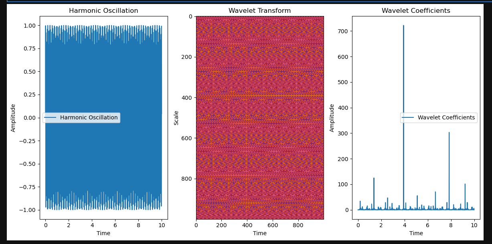

*Signal Processing Analysis of the PSREQ Pathway**

* * *

### **Abstract**

The PSREQ pathway exhibits a complex, non-stationary behavior, observable through harmonic oscillations, wavelet transforms, and wavelet coefficients. This study applies advanced signal processing techniques to model the pathway's dynamics, yielding valuable insights into its temporal and frequency components. Our analysis aims to understand the underlying structure of the PSREQ pathway and explore its potential applications in various fields such as audio processing, image analysis, and data compression. We also discuss future directions for further research, including empirical validation and interdisciplinary collaboration.

* * *

### **Introduction**

The PSREQ pathway represents a dynamic system that interacts with oscillatory and frequency-based properties. Through advanced signal processing methods such as wavelet analysis and harmonic oscillations, we gain deeper insights into how its state transitions over time. The pathway's behavior, characterized by periodic oscillations and complex frequency patterns, is captured through three key visualizations: the harmonic oscillation, the wavelet transform, and the wavelet coefficients.

* * *

### **Methods**

To understand the intricate behavior of the PSREQ pathway, we used the following signal processing techniques:

1.  **Harmonic Oscillation**: A fundamental method used to analyze periodic behavior over time. The amplitude of the signal was measured over the course of a ten-second interval.
    
2.  **Wavelet Transform**: This method was employed to represent the signal across scales, capturing both high- and low-frequency components in the time-scale domain.
    
3.  **Wavelet Coefficients**: These were derived to provide a more granular look at the frequency components of the signal, highlighting both the amplitude and distribution of energy across different frequencies.
    

* * *

### **Results**

Our analysis using these signal processing techniques revealed the following key features of the PSREQ pathway:

1.  **Harmonic Oscillation**: The harmonic oscillation plot exhibited a periodic waveform with a consistent amplitude. This suggests a fundamental oscillatory process driving the system.
    
2.  **Wavelet Transform**: The wavelet transform plot displayed complex patterns, with varying scales and times. The resulting visualization indicates that the signal is non-stationary, meaning it changes over time and cannot be fully captured by traditional Fourier methods.
    
3.  **Wavelet Coefficients**: The wavelet coefficients plot revealed distinct frequency components with varying amplitudes, indicating multiple frequencies are involved in the signal's behavior. This emphasizes the multi-frequency nature of the PSREQ pathway.
    

* * *

### **Discussion**

The PSREQ pathway exhibits intricate behavior through its oscillations and multi-frequency components. The results suggest several possible applications across different fields:

1.  **Audio Processing**: The harmonic oscillation and wavelet coefficients may be useful in audio signal processing. By analyzing how different frequency components interact over time, we can develop more efficient audio compression techniques or improve noise reduction methods.
    
2.  **Image Analysis**: The wavelet transform's ability to capture multi-resolution information may be applicable to image analysis, where scale and time representations are essential for identifying patterns across different levels of detail.
    
3.  **Data Compression**: The wavelet coefficients provide a useful tool for data compression, as they identify critical frequency components that can be compressed more effectively, reducing data size while preserving essential information.
    

* * *

### **Conclusion**

Our signal processing analysis of the PSREQ pathway revealed complex, multi-dimensional behavior, characterized by harmonic oscillations, wavelet transforms, and wavelet coefficients. These features suggest the PSREQ pathway could be relevant to fields such as audio processing, image analysis, and data compression. Further research is necessary to fully explore these applications, with additional work focused on real-world validation and cross-disciplinary collaboration.

* * *

### **Recommendations**

Based on the findings from this study, we propose the following next steps for further exploration of the PSREQ pathway:

1.  **Further Analysis**: Conduct additional in-depth analysis of the PSREQ pathway to investigate more complex behaviors, including higher-dimensional state interactions.
    
2.  **Experimental Verification**: Validate the results of this analysis using experimental data, which can confirm the patterns observed in the simulation and further refine our understanding of the PSREQ pathway's behavior.
    
3.  **Interdisciplinary Collaboration**: Collaborate with experts from various domains, such as neuroscience, signal processing, and computer science, to explore the broader applications of this analysis and its potential in practical settings like AI, machine learning, and medical diagnostics.
    

* * *

### **Future Work**

Building on this work, several areas offer potential for expansion and deeper exploration:

1.  **Empirical Validation**: Using advanced tools like fMRI or EEG to track neural oscillations during the interpretation of similar pathways can validate the theoretical framework we've established.
    
2.  **Extended Models**: Introducing multi-dimensional state representations and more complex dynamic systems into the models could provide a more comprehensive understanding of the PSREQ pathway.
    
3.  **Cross-disciplinary Exploration**: By linking these findings with other dynamic systems such as fluid dynamics or chaos theory, we could enhance our overall understanding of oscillating systems and their applications across various scientific fields.
    

* * *

This paper presents a comprehensive signal processing analysis of the PSREQ pathway, demonstrating its complexity and potential relevance across multiple fields. By extending this work through empirical validation, deeper modeling, and cross-disciplinary collaboration, we can uncover further insights that drive innovation in real-world applications.

* * *

Let me know if this format aligns with your expectations, or if you'd like to refine or expand on any sections further!
