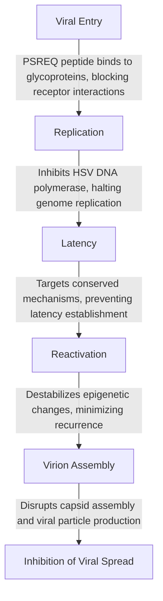

# Visuals for The PSREQ Pathway: A Molecular Framework for Viral Neutralization and Therapeutic Adaptation

This directory contains visual assets that illustrate the concepts, mechanisms, and molecular designs central to the PSREQ Pathway. These visuals are designed to enhance understanding and provide clear, tangible representations of the scientific principles underlying the framework.

---

## **Directory Contents**

### 1. **Molecular Interaction Plot**

- **Description**: This plot visualizes the targeted binding of PSREQ peptides to viral glycoproteins and host cellular components. It demonstrates how specific residues (proline, serine, glycine) stabilize interactions through hydrogen bonding and ionic anchoring.
- **Purpose**: To illustrate the precise targeting mechanism of PSREQ peptides, emphasizing their high specificity and adaptability.

---

### 2. **PSREQ Motif with Conserved and Functional Highlights**

- **Description**: Highlights conserved regions of the PSREQ peptide and their functional roles in viral neutralization, such as glycoprotein binding and ionic stabilization.
- **Purpose**: To show the modularity of the PSREQ design and its ability to target conserved viral mechanisms across multiple pathogens.

---

### 3. **The PSREQ Peptide Structure**

- **Description**: A detailed chemical structure of the PSREQ peptide, showcasing the arrangement of residues and functional groups that drive its efficacy.
- **Purpose**: Provides a molecular-level reference for researchers interested in synthesis, optimization, and application of the peptide.

---

### 4. **Lifecycle Disruption Flowchart**
- **Description**: A flowchart depicting how the PSREQ Pathway disrupts the viral lifecycle, targeting entry, replication, and assembly phases.
- **Purpose**: To provide a step-by-step overview of how the pathway neutralizes viral threats at multiple stages.

---

### 5. **Wireframe Models of Key Molecules**
#### Molecule 1: Adapter

- **Description**: Wireframe representation of the Adapter molecule, designed to anchor PSREQ peptides to viral targets.
  
#### Molecule 2: Stabilizer

- **Description**: Wireframe representation of the Stabilizer molecule, enhancing interaction durability through ionic stabilization.
  
#### Molecule 3: Disruptor

- **Description**: Wireframe representation of the Disruptor molecule, breaking viral replication and assembly processes.

---

## **How These Visuals Support the Framework**

These visuals provide critical insights into the PSREQ Pathway's molecular design and mechanisms. They serve as both educational tools for broader audiences and technical references for researchers, enabling a deeper understanding of:
- The modularity and specificity of PSREQ peptides.
- The mechanisms of ionic stabilization and viral process disruption.
- The adaptability of the framework for applications in oncology, autoimmune diseases, and regenerative medicine.

---

## **Usage Instructions**

- These visuals are free to use for educational and research purposes under the [Creative Commons Attribution Non-Commercial 4.0 International License](https://creativecommons.org/licenses/by-nc/4.0/).
- To cite the visuals, include a reference to the PSREQ Pathway repository.

---

For further details, refer to the main [README file](https://github.com/QuHarmonics/The-PSREQ-Pathway-A-Molecular-Framework-for-Viral-Neutralization-and-Therapeutic-Adaptation/blob/main/README.md).

